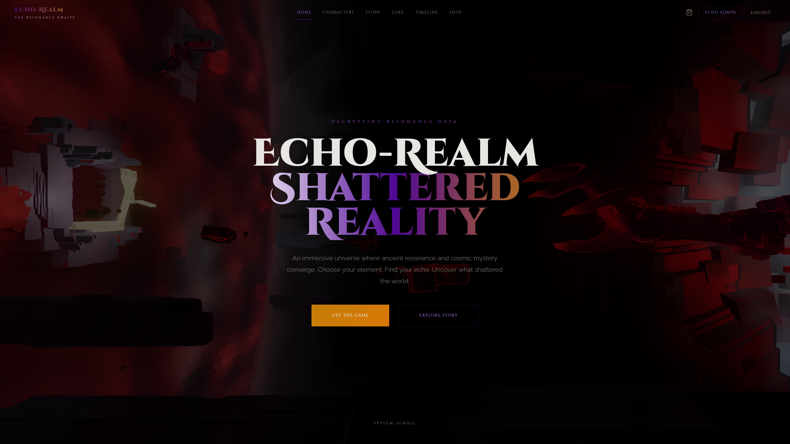
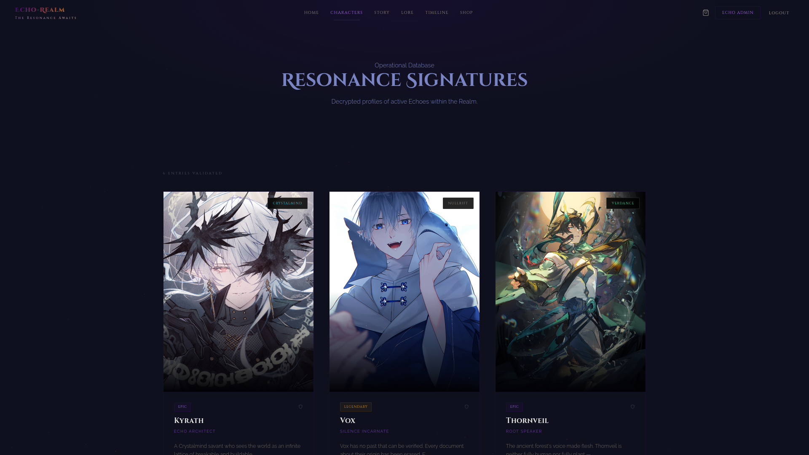
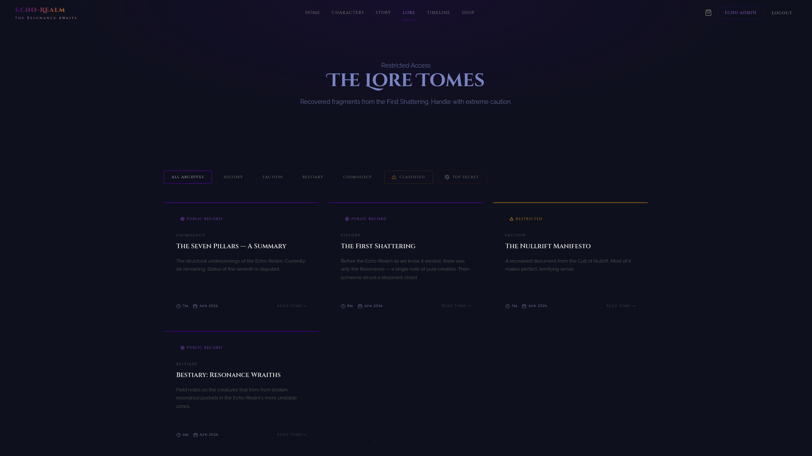
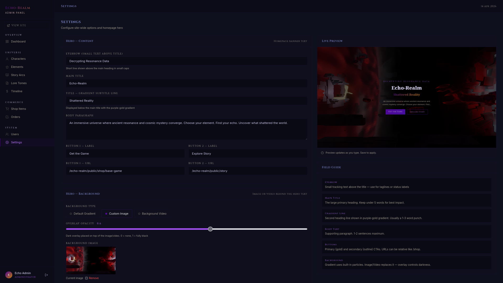

<!-- LOGO -->
<div align="center">

<svg width="420" height="72" viewBox="0 0 420 72" fill="none" xmlns="http://www.w3.org/2000/svg">
  <defs>
    <linearGradient id="lg" x1="0" y1="0" x2="420" y2="0" gradientUnits="userSpaceOnUse">
      <stop offset="0%"   stop-color="#c084fc"/>
      <stop offset="55%"  stop-color="#a855f7"/>
      <stop offset="100%" stop-color="#f59e0b"/>
    </linearGradient>
  </defs>
  <text x="50%" y="44"
        font-family="Georgia, 'Times New Roman', serif"
        font-size="46" font-weight="700"
        text-anchor="middle" letter-spacing="6"
        fill="url(#lg)">ECHO-REALM</text>
  <text x="50%" y="64"
        font-family="Georgia, serif"
        font-size="11" font-weight="400"
        text-anchor="middle" letter-spacing="10"
        fill="#7a6f9a">THE RESONANCE AWAITS</text>
</svg>

<br>

<p>
A modern game-centric web platform combining digital commerce with immersive storytelling.<br>
Purchase the game, unlock characters, and uncover a universe built on fractured resonance.
</p>

<br>

[](https://laravel.com)
[](https://php.net)
[](https://mysql.com)
[](https://apachefriends.org)


<br>

<a href="#installation"><kbd> <br> Installation <br> </kbd></a>&ensp;&ensp;
<a href="#themes"><kbd> <br> Universe <br> </kbd></a>&ensp;&ensp;
<a href="#storyline"><kbd> <br> Storyline <br> </kbd></a>&ensp;&ensp;
<a href="#lore-tomes"><kbd> <br> Lore Tomes <br> </kbd></a>&ensp;&ensp;
<a href="#erd"><kbd> <br> ERD <br> </kbd></a>&ensp;&ensp;
<a href="#use-case"><kbd> <br> Use Case <br> </kbd></a>&ensp;&ensp;
<a href="#stack"><kbd> <br> Stack <br> </kbd></a>&ensp;&ensp;

</div><br><br>

---

## Preview

<div align="center">

<table>
<tr>
<td></td>
<td></td>
</tr>
<tr>
<td></td>
<td></td>
</tr>
</table>

</div>

---

<a id="universe"></a>
## The Universe

Echo-Realm is not a world that was built — it is a world that *survived*. The reverberating aftermath of the **Fundamental Discord**, a dissonant cosmic event that shattered the primordial Resonance and scattered its frequencies across broken dimensional walls.

Six elements stabilized from the wreckage. Six **Resonance Pillars** hold reality together. A seventh exists only in theory.

The platform brings this universe to life through:

- **Characters** — each carrying a shard of broken Resonance, with full ability sets, lore, and stat profiles
- **Story Arcs** — narrative chapters in reader format with per-chapter scroll progress
- **Lore Tomes** — a classified archive system with three access tiers: Public, Classified, Top Secret
- **Timeline** — a chronological record from Year 0 to the present, grouped by era
- **Shop** — purchase the game, character bundles, skins, premium currency, and cosmetics

---

<a id="storyline"></a>
## Storyline

> Full story content and all chapters: [STORY.md](./STORY.md)

### The Timeline

| Era | Year | Event |
|---|---|---|
| The Before | Year 0 | **The Fundamental Discord** — An unknown force strikes the primordial Resonance, shattering it into the dimensional cascade that creates the Echo-Realm. |
| The First Age | Year 1–400 | **Formation of the Seven Pillars** — The six elements stabilize into their Resonance Pillars. The Seventh Pillar forms silently, undetected, in an unmapped region. |
| The Second Age | Year 1,200 | **The Deep Root Accord** — The sentient forests and mortal civilizations sign the Deep Root Accord, establishing peaceful coexistence and the beginning of Verdance cultivation. |
| The Collapse Era | Year 2,847 | **The Third Collapse** — The Nullrift Pillar catastrophically destabilizes. Half the known realm is remapped. The Pillar disappears. 40% of the global population is lost. |
| The Rebuilding | Year 3,100 | **The Celestial Guardian Pact** — Seven celestial guardians are appointed to protect the remaining Pillars. Seraphon is assigned to the Voidfire Pillar. |
| The Current Age | Year 3,247 | **The Ashenveil Defiance** — Seraphon disobeys the Guardian Council to save Ashenveil village. The Voidfire Pillar cracks. She is cast down and her celestial fire transmuted. |
| | Year 3,260 | **Kyrath's Dismissal** — Architect Kyrath presents evidence of a flaw in the Echo Lattice to the Unbound Scholarium. He is accused of treason and forced to flee with his blueprints. |
| | Year 3,271 | **Vela's Village Erased** — An unregistered Nullrift surge erases the village of Stormhaven. Vela, caught inside a lightning strike, is the sole survivor. |
| | Year 3,280 *(Now)* | **Seraphon Returns to Ashenveil** — A child named Pip reveals they can see a crack in the sky. The story begins. |

---

### Arc I — The Ember Descends

`Ongoing` <br>·<br> Chapter I

The story begins with Seraphon's fall from grace and her first steps into the mortal world. An unlikely alliance, a prophecy that should not exist, and a crack in the sky that everyone is pretending not to notice.

<br>

> She fell for seventeen days.
>
> Not because the distance was that great — the gap between the celestial sphere and the mortal world could be crossed in an hour by a healthy wind. She fell slowly because falling was all she had left to do, and she did not want to arrive.
>
> The village of Ashenveil appeared below her as a collection of amber lights. It had been rebuilt three times since she saved it. The original structures were long gone — replaced by new wood, new stone, new generations who had heard the story of the guardian who broke heaven's law for them but would not recognize her face if they passed her on the road.
>
> *"You're burning my wheat,"* said a voice.

<br>

[Read Chapter I &rarr;](https://your-site.com/story/arc-1-the-ember-descends) &ensp;&ensp; [Read Chapter II &rarr;](https://your-site.com/story/arc-1-the-architects-confession)

---

<a id="lore-tomes"></a>
## Lore Tomes

The archive classifies all knowledge by access level. Some truths cost more than others.

| Classification | Access |
|---|---|
| Public Record | Open to all |
| Classified | Restricted — login required |
| Top Secret | Level 5 clearance — handle with caution |

---

### Featured — The Seven Pillars: A Summary

`Public Record` <br>·<br> Cosmology <br>·<br> 7 min read

The Echo-Realm is held together by seven **Resonance Pillars** — massive dimensional anchors formed in the immediate aftermath of the First Shattering.

| Pillar | Status | Note |
|---|---|---|
| Voidfire | `UNSTABLE` | Cracked during the Seraphon Incident. Localized thermal bleed detected. |
| Crystalmind | `OPTIMAL` | Intact. Kyrath's Echo Lattice supplementing structural load. |
| Stormblood | `OPTIMAL` | Intact. No significant static variance reported. |
| Verdance | `OPTIMAL` | Intact. Deep Root Council maintains active repair protocols. |
| Ashenbloom | `UNKNOWN` | Territory controlled by the Laughing Funeral. Reconnaissance data corrupted. |
| Nullrift | `MISSING` | Destroyed or relocated during the Third Collapse, 600 years ago. |
| The Seventh | `THEORETICAL` | Existence disputed. No element assigned. Signal non-existent. |

> *"We do not live in creation. We live in the aftermath."*
> — Kyrath, Echo Architect

[Browse all Lore Tomes &rarr;](https://your-site.com/lore)

---

<a id="installation"></a>
## Installation

**Requirements:** PHP 8.1+, Composer, MySQL, Apache with `mod_rewrite` enabled (XAMPP recommended)

```shell
# Clone
git clone https://github.com/your-username/echo-realm.git
cd echo-realm

# Dependencies
composer install --no-scripts

# Environment
cp .env.example .env
php artisan key:generate

# Edit .env — set DB_DATABASE=echo_realm, DB_USERNAME, DB_PASSWORD

# Database
php artisan migrate
php artisan db:seed

# Storage
php artisan storage:link
php artisan optimize:clear
```

### Default Credentials

| Role | Email | Password |
|---|---|---|
| Administrator | `admin@echo-realm.com` | `admin123` |
| Test User | `aria@example.com` | `password` |

### Access URLs

| | URL |
|---|---|
| Client site | `http://localhost/echo-realm/public` |
| Admin panel | `http://localhost/echo-realm/public/admin` |

---

## Project Structure

```
echo-realm/
├── app/
│   ├── Http/
│   │   ├── Controllers/
│   │   │   ├── Admin/          # Dashboard, Characters, Elements, Lore,
│   │   │   │                   # Stories, Timeline, Shop, Orders, Users
│   │   │   └── Client/         # Home, Characters, Lore, Story,
│   │   │                       # Timeline, Shop, Cart, Auth
│   │   └── Middleware/
│   └── Models/                 # User, Character, Element, LoreEntry,
│                               # Story, TimelineEvent, ShopItem, Order
├── database/
│   ├── migrations/
│   └── seeders/                # 6 characters, 6 elements, 4 lore entries,
│                               # 2 story chapters, 9 timeline events, 8 shop items
├── resources/
│   └── views/
│       ├── layouts/
│       │   ├── client.blade.php
│       │   └── admin.blade.php
│       ├── client/             # All public-facing pages
│       └── admin/              # All admin panel pages
├── routes/web.php
├── scripts/
│   ├── fix-storage.sh          # Fixes image 404 on XAMPP
│   └── patch-platform-check.sh
├── public/                     # Web root
├── install.sh
└── install.bat
```

---

<a id="technologies"></a>
## Technologies

| Layer | Technology | Purpose |
|---|---|---|
| Framework | Laravel 10 | Routing, ORM (Eloquent), Blade templates, middleware, storage |
| Language | PHP 8.1+ | Server-side application logic |
| Database | MySQL 8 | Relational data storage |
| Server | Apache via XAMPP | Local development environment |
| Auth | Laravel Session Auth | Dual guard — client users and administrators |
| Storage | Laravel Filesystem (`public` disk) | Character images, shop images, hero backgrounds, hero videos |
| Frontend | Vanilla CSS + JavaScript | Particle canvas, scroll reveal, animated hero, tab switcher, live admin preview |
| Fonts | Cinzel Decorative, Cinzel, Raleway | Display, heading, and body typography via Google Fonts |

---

<a id="erd"></a>
## Entity Relationship Diagram

<div align="center">


</div>

```
USERS ─────────────── ORDERS ─────────────────── ORDER_ITEMS
  id PK                 id PK                       id PK
  name                  order_number UK              order_id       FK → ORDERS
  username UK           user_id        FK → USERS    shop_item_id   FK → SHOP_ITEMS
  email UK              total                        quantity
  role                  status                       price
  is_banned             billing_info (json)
  last_login_at

ELEMENTS               CHARACTERS                  SHOP_ITEMS
  id PK                  id PK                       id PK
  name                   name                        name
  slug UK                slug UK                     slug UK
  color                  element_id  FK → ELEMENTS   price
  glow_color             rarity                      original_price
  symbol                 role                        type
                         faction                     rarity
                         stats (json)                stock
                         abilities (json)             is_featured
                         is_featured                  includes (json)
                         is_published

LORE_ENTRIES           STORIES                     TIMELINE_EVENTS
  id PK                  id PK                       id PK
  title                  title                       title
  slug UK                slug UK                     era
  classification         arc_number                  year_in_lore
  category               chapter_number              type
  content (longtext)     status                      color
  read_time              is_published                is_published
  is_published

SETTINGS
  id PK
  key UK                 # hero_title, hero_bg_image, hero_bg_video,
  value (longtext)       # hero_eyebrow, hero_btn1_text, site_name …
  type
```

---

<a id="use-case"></a>
## Use Case Diagram

<div align="center">


</div>

```
                  ┌──────────────────────────────────────────────────────┐
                  │                  Echo-Realm Platform                 │
                  │  ┌──────────────────────┐  ┌────────────────────────┐│
                  │  │    Public access     │  │     Admin panel        ││
  [Visitor] ──────┼─►│  Explore universe    │  │  Manage characters     ││◄── [Administrator]
                  │  │  Browse shop         │  │  Manage elements       ││
                  │  │  Register / Login    │  │  Manage story arcs     ││
                  │  └──────────────────────┘  │  Manage lore tomes     ││
                  │  ┌──────────────────────┐  │  Manage timeline       ││
                  │  │   Login required     │  │  Manage shop items     ││
  [Registered] ───┼─►│  Manage cart         │  │  Process orders        ││
     [User]       │  │  Checkout & pay      │  │  Manage users          ││
  (extends        │  │  View order history  │  │  Configure site        ││
   Visitor)       │  │  Manage profile      │  │  Hero CMS              ││
                  │  └──────────────────────┘  └────────────────────────┘│
                  └──────────────────────────────────────────────────────┘
```

---

## Features

### Client

- Immersive homepage with animated particle canvas and fully configurable hero CMS (text, buttons, gradient / image / video background with overlay control)
- Character roster with element, rarity, and role filters — full profile pages with ability cards, animated stat bars, lore tab
- Story reader with scroll progress bar and chapter-to-chapter navigation
- Lore archive with three-tier classification system and category filters
- Alternating vertical timeline grouped by historical era
- Full e-commerce: cart with quantity management, checkout, order history, item detail pages
- User authentication with register, login, profile, and order tracking

### Admin Panel

- Dashboard with live content and revenue stats, order status breakdown, recent tables, quick actions
- Full CRUD for all content types — Characters (with JSON ability/stat editors), Elements (with color pickers), Story Arcs, Lore Tomes, Timeline Events, Shop Items (with image upload)
- Order management with status transitions
- User management with ban / unban
- Hero CMS with live preview: edit all text fields, button labels and URLs, upload background image or video, control overlay darkness — all without leaving the settings page

---

## Inspired By

This project draws creative and structural inspiration from:

| Project | Influence |
|---|---|
| [Honkai: Star Rail](https://hsr.hoyoverse.com) | Character presentation, rarity system, lore archive structure |
| [Wuthering Waves](https://wutheringwaves.kurogames.com) | Resonance / element system, timeline-driven narrative |
| [Genshin Impact](https://genshin.hoyoverse.com) | Faction-based world building, character and ability architecture |

> Built as an academic full-stack Laravel project. Not affiliated with or endorsed by HoYoverse or Kuro Games.

---

<div align="right">

<sub>Echo-Realm <br>·<br> Laravel 10 <br>·<br> PHP 8.5 <br>·<br> MySQL</sub>

</div>
